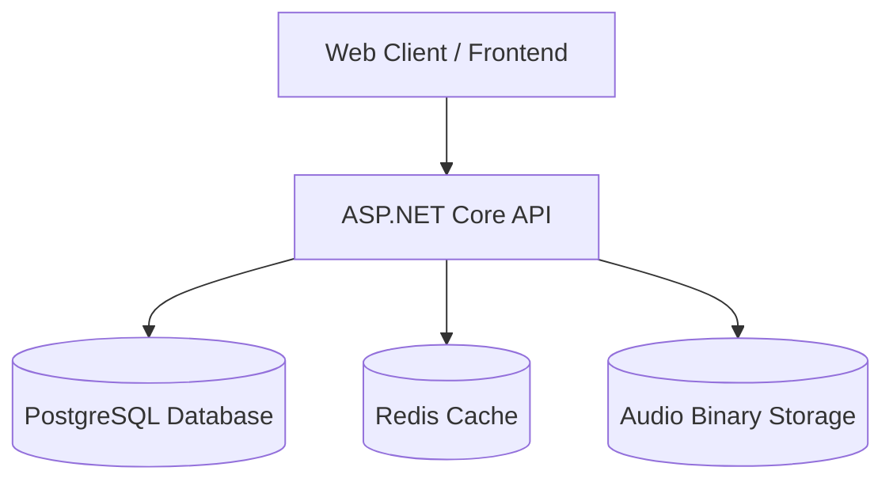

# SFX Library - Backend Asset Management API
## Overview
SFX Library is a backend-focused application for managing and serving sound-effect assets. It was built as a personal tool and learning/portfolio project to develop practical experience with backend engineering.

## What This Project Does
This project is intended to be an audio asset management tool for teams or organizations that need a centralized place to store, organize, and share sound-effect assets.

For example, in a game development environment, a sound designer could upload and categorize audio assets so that other teams, such as animation or video editing, can search the library and retrieve the sounds they need without having to request each asset directly from the sound design team.

### Users can
* Creating, uploading, and managing audio assets.
* Organizing assets using categories and metadata.
* Searching and retrieving audio assets.
* Previewing and downloading audio files.
* Controlling access to management operations through authentication and authorization.

A lightweight web client is currently included to demonstrate browsing, searching, previewing, and downloading assets. Management workflows are currently performed through the API using Scalar/OpenAPI.

## Preview & Demo
A short demo showing the current web client
* Browse and search audio assets.
* Preview audio files.
* Download audio files.

https://github.com/user-attachments/assets/528d4c20-3d33-4c00-b93b-f0b310963852

## Technology Stack
| Domain | Technology | Purpose |
| :--- | :--- | :--- |
| **Backend Framework** | ASP.NET Core (C#) | RESTful API, File Streaming, Custom Validation Pipeline |
| **Primary Database** | PostgreSQL | Relational metadata storage, categories, index tracking |
| **Caching Layer** | Redis | High-speed response caching & invalidation |
| **DevOps & Testing** | Docker, Docker Compose, Testcontainers | Environment orchestration & isolated API integration tests |
| **Frontend** | HTML5, CSS3, Vanilla JavaScript | Lightweight MVP for audio scrubbing, playback, and API consumption |

## Key Feature Highlights
* **Stream-Based File Delivery:** Streams audio files directly from storage for preview and download.
* **Security-First File Signature Validation:** Inspects raw magic byte headers on incoming files. (verifying `.wav`, `MPEG`.)
* **Smart Redis Caching:** Caches category structures and high-traffic metadata queries with explicit cache-invalidation triggers during asset updates/deletions.
* **Automated Containerized Integration Testing:** Features an integration test suite that spins up ephemeral PostgreSQL containers in Docker to validate real database state, migrations, and constraint enforcement.
  
## Architecture


The application follows a simple API-centered architecture. The frontend communicates with the ASP.NET Core API, which coordinates access to the application's data and storage components.
* PostgreSQL stores persistent relational data such as audio asset metadata and categories.
* Redis is used as a cache to reduce repeated database queries. It is not a source of truth for application data.
* Filesystem storage is used for the audio binaries, keeping large file data separate from relational metadata.
* ASP.NET Core API handles application logic, authentication, authorization, validation, caching, and communication with the underlying storage systems.

This separation allows each component to have a clear responsibility while keeping the application relatively simple to run locally with Docker Compose.

## Security

The API includes several security measures for protecting endpoints and handling untrusted input:

* JWT Authentication — protects authenticated API endpoints.
* Role-Based Authorization — restricts administrative operations to authorized roles.
* Rate Limiting — limits excessive requests to protected API resources.
* File Upload Validation — validates uploaded audio files before they are stored.
* ProblemDetails — provides structured API error responses without exposing unnecessary internal details.
* Configuration & Secrets — sensitive configuration is kept outside source control using environment-specific configuration and development secrets.
* Environment-Specific Behavior — development-only functionality is disabled when running in the Production environment.

## Testing

The project currently focuses on integration testing to verify application behavior across the API, database, caching, authentication, and file-storage boundaries.
The test suite uses xUnit and Testcontainers where isolated infrastructure is required.

Tests cover areas including:
* API endpoint behavior
* Authentication and authorization
* Rate limiting
* API error handling
* Database interactions
* Redis-related behavior
* Audio file upload and retrieval

Unit testing and additional test coverage are planned as future improvements.

## Docker & Deployment

The application can be run using Docker Compose with the API, PostgreSQL, and Redis running as separate services.

Two Compose configurations are provided:
* **compose.yaml** for development.
* **compose.production.yaml** for a production-like local environment with reduced external exposure and production configuration.

Persistent application data is stored outside the application container, with PostgreSQL using a Docker volume and audio files using a host bind mount.

## Getting Started
### Prerequisites
* Docker
* Docker Compose

### Run the Application
Clone the repository, configure the required environment variables using .env.example, then start the application with Docker Compose.
```
 docker compose up --build
```
The API will be available at http://localhost:8080.

For the production-like configuration:
```
 docker compose -f compose.production.yaml up --build
```
## API Usage
Management endpoints require authentication.
For local development:

1. Start the application with Docker Compose.
2. Open Scalar (http://localhost:8080/scalar/v1) and use the development authentication endpoint to obtain a JWT.
3. Authorize the Scalar client using the returned Bearer token.
4. Use the authenticated endpoints to upload or delete audio assets.

The public web client does not require authentication for browsing, searching, previewing, and downloading assets.

## Known Issues & Limitations
* HTTPS and a reverse proxy are not currently configured.
* Audio processing such as format conversion is handled synchronously and could be moved to background processing for larger workloads.
* Audio files are currently stored on the local filesystem rather than object storage.
* Waveform data is not pre-computed, so waveform rendering requires additional client-side processing.
